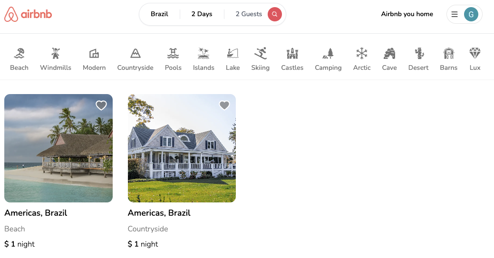
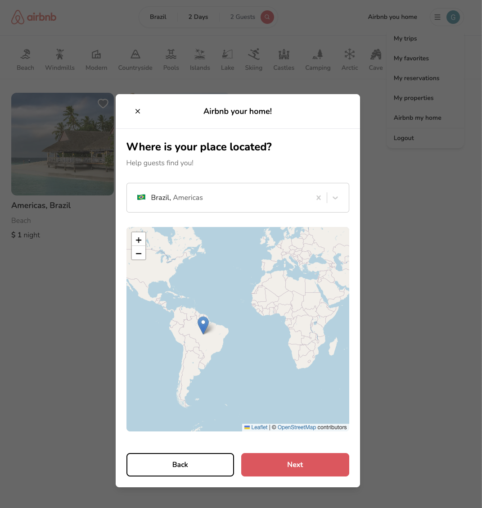
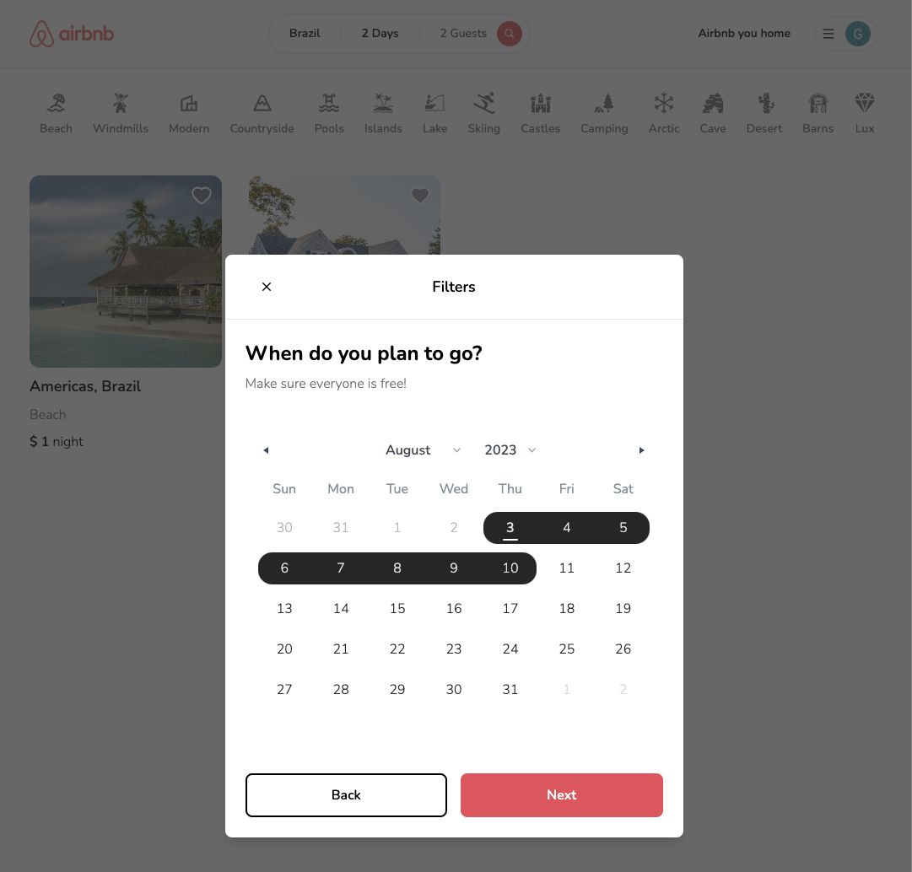

<p align="left">
   
</p>


> Read the best of news about tech
> 
[](https://github.com/ZaninDe)
[](#)
[](https://github.com/ZaninDe/airbnb-clone/stargazers)
[](https://github.com/ZaninDe/airbnb-clone/network/members)
[](https://github.com/ZaninDe/airbnb-clone/graphs/contributors)

---

# :pushpin: Table of Contents

- [:pushpin: Table of Contents](#pushpin-table-of-contents)
- [:rocket: Features](#rocket-features)
      - [Enjoy your subscription and get access entire of the posts](#enjoy-your-subscription-and-get-access-entire-of-the-posts)
- [:construction_worker: Installation](#construction_worker-installation)
  - [necessary settings](#necessary-settings)
    - [**Requirements**](#requirements)
    - [**Clone the project**](#clone-the-project)
    - [**Running the project**](#running-the-project)
- [:postbox: Faq](#postbox-faq)
- [:bug: Issues](#bug-issues)
- [:tada: Contributing](#tada-contributing)
- [:closed_book: License](#closed_book-license)

<br />
<p align="center"></p>

# :rocket: Features

* ### Tailwind design
* ### Tailwind animations and effects
* ### Full responsiveness
* ### Credential authentication
* ### Google authentication
* ### Github authentication
* ### Image upload using Cloudinary CDN
* ### Client form validation and handling using react-hook-form
* ### Server error handling using react-toast
* ### Calendars with react-date-range
* ### Page loading state
* ### Page empty state
* ### Booking / Reservation system
* ### Guest reservation cancellation
* ### Owner reservation cancellation
* ### Creation and deletion of properties
* ### Pricing calculation
* ### Advanced search algorithm by category, date range, map location, number of guests, rooms and bathrooms
* ### For example we will filter out properties that have a reservation in your desired date range to travel
* ### Favorites system
* ### Shareable URL filters

<div align="center">

</div>


#### Add properties or search for them

<div align="center">
  
</div>

#### use the filter to find the better place to you

<div align="center">
  
</div>


# :construction_worker: Installation

## necessary settings

### **Requirements**

What you'll need:

- [Git](https://git-scm.com/)
- [npm](https://classic.npmpkg.com)
- [Google Client](https://developers.google.com/api-client-library?hl)
- [Claudinary](https://cloudinary.com/)
- [MongoDB](https://www.mongodb.com/)

Create account and configure the external services:

- [Google Client](https://developers.google.com/api-client-library?hl)
- [Claudinary](https://cloudinary.com/)
- [MongoDB](https://www.mongodb.com/)

### **Clone the project**

```bash
# Execute the command bellow to clone the repositore
$ git clone https://github.com/ZaninDe/airbnb-clone.git
# go to directory
$ cd airbnb-clone
```

### **Running the project**

```bash
# Execute npm to install the dependencies
$ npm install
# in the root of project, create a new file and clone .env.local.example
# change the name of file copy to .env.local
# fill the enviroment variables following the guide of the comments
$ cd .env
# to run the application:
$ npm dev
```

---


# :postbox: Faq

**Question:** What are the tecnologies used in this project?

**Answer:** The tecnologies used in this project are [Nextjs 13](https://nextjs.org/) + [Tailwindcss](https://tailwindcss.com/).

# :bug: Issues

Feel free to **file a new issue** with a respective title and description on the [airbnb clone](https://github.com/ZaninDe/airbnb-clone/issues) repository. If you already found a solution to your problem, **I would love to review your pull request**! Have a look at our [contribution guidelines](https://github.com/ZaninDe/airbnb-clone/blob/master/CONTRIBUTING.md) to find out about the coding standards.

# :tada: Contributing

Check out the [contributing](https://github.com/ZaninDe/airbnb-clone/blob/master/CONTRIBUTING.md) page to see the best places to file issues, start discussions and begin contributing.

# :closed_book: License

Released in 2023 (Work in progress)
This project is under the [MIT license](https://github.com/ZaninDe/airbnb-clone/master/LICENSE).

Made with love by [Gabriel Zanin](https://github.com/ZaninDe) 🚀